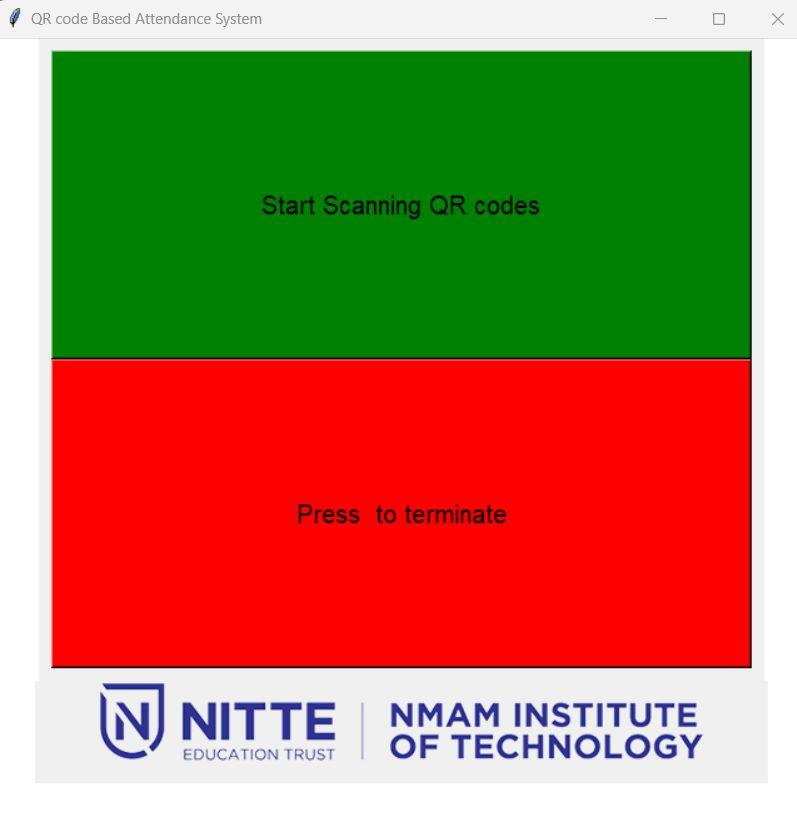

# qr-reader-attendance-system

QR reader + attendance system with Python and OpenCV !

This project is a fork of the project [here](https://github.com/computervisioneng/qr-reader-attendance-system.git)

**Whats this project about:**

*Watched the above video to  know about this project
 *Things I have added
		*Has a GUI with my college logo on it 
			*Has a button to start scanning
			*Has a button to stop scanning
					
						

* Bullet list
	* Nested bullet
                  	* Sub-nested bullet etc
              * Bullet list item 2

